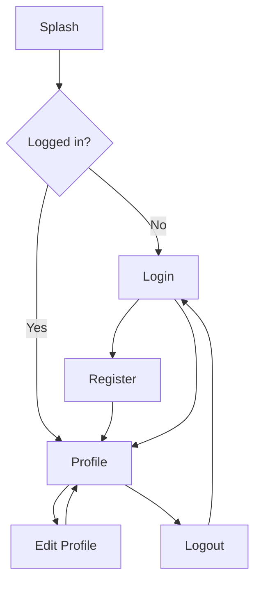

# Profile App — Flutter + Firebase

A beginner-friendly, production-style profile app with Firebase Authentication, Cloud Firestore, and Firebase Storage. Built with a clean **iOS-style** Cupertino UI.

## Features

- Register / Login / Logout (email & password)
- View profile with real-time Firestore updates
- Edit profile fields and upload profile photo
- Secure Firestore & Storage security rules included

## Project structure

```
lib/
├── main.dart
├── firebase_options.dart      # Generated by FlutterFire CLI
├── models/user_model.dart
├── services/
│   ├── auth_service.dart
│   ├── user_service.dart
│   └── storage_service.dart
├── screens/                   # Splash, Login, Register, Profile, Edit
├── widgets/
└── utils/
```

---

## Quick start

### Prerequisites

- [Flutter SDK](https://docs.flutter.dev/get-started/install) (3.16+)
- Xcode (for iOS Simulator)
- CocoaPods (`sudo gem install cocoapods`)
- [Firebase CLI](https://firebase.google.com/docs/cli)
- [FlutterFire CLI](https://firebase.flutter.dev/docs/cli)

### 1. Generate platform folders (if needed)

If `ios/` or `android/` are incomplete, from the project root:

```bash
flutter create . --org com.profileapp --project-name profile_app
```

This merges standard Flutter platform files without replacing your `lib/` code.

### 2. Install dependencies

```bash
flutter pub get
```

### 3. Create a Firebase project

1. Go to [Firebase Console](https://console.firebase.google.com/)
2. Click **Add project** → name it (e.g. `profile-app`) → continue
3. Disable Google Analytics if you want (optional for learning)

### 4. Install & log in to Firebase CLI

```bash
npm install -g firebase-tools
firebase login
```

### 5. Install FlutterFire CLI

```bash
dart pub global activate flutterfire_cli
```

Ensure `~/.pub-cache/bin` is on your `PATH`.

### 6. Configure Flutter app with Firebase

From the project root:

```bash
flutterfire configure
```

- Select your Firebase project
- Select platforms: **iOS** and **Android** (and others if needed)
- This generates `lib/firebase_options.dart` and downloads:
  - `ios/Runner/GoogleService-Info.plist`
  - `android/app/google-services.json`

### 7. Enable Firebase Authentication

1. Firebase Console → **Build** → **Authentication**
2. **Get started** → **Sign-in method**
3. Enable **Email/Password** → Save

### 8. Set up Cloud Firestore

1. Firebase Console → **Build** → **Firestore Database**
2. **Create database** → start in **test mode** for local dev (then deploy rules below)
3. Deploy security rules from this repo:

```bash
firebase init firestore   # select existing project, use firestore.rules
firebase deploy --only firestore:rules
```

Or paste `firestore.rules` into the console **Rules** tab and publish.

**Collection structure:**

| Collection | Document ID | Fields |
|------------|-------------|--------|
| `users` | `{uid}` | `uid`, `fullName`, `username`, `email`, `bio`, `phone`, `photoUrl`, `createdAt`, `updatedAt` |

### 9. Set up Firebase Storage

1. Firebase Console → **Build** → **Storage**
2. **Get started** → choose a location
3. Deploy storage rules:

```bash
firebase init storage    # use storage.rules
firebase deploy --only storage
```

**Image path:** `profile_images/{uid}/profile.jpg`

### 10. iOS configuration

#### CocoaPods

```bash
cd ios
pod install
cd ..
```

#### Xcode / Simulator

- Open `ios/Runner.xcworkspace` in Xcode (after `flutter create`)
- Select an iPhone simulator
- Bundle ID should match what you registered in Firebase (e.g. `com.profileapp.profileApp`)

`ios/Runner/Info.plist` already includes photo library usage descriptions for `image_picker`.

#### Minimum iOS

In `ios/Podfile`, ensure platform is at least 13.0:

```ruby
platform :ios, '13.0'
```

### 11. Android configuration (optional)

After `flutterfire configure`, ensure `android/app/build.gradle` applies the Google services plugin (FlutterFire usually adds this).

### 12. Run the app

```bash
# List devices
flutter devices

# iOS Simulator
open -a Simulator
flutter run
```

---

## Firestore security rules

See [`firestore.rules`](firestore.rules). Users can only read/write their own `users/{uid}` document.

## Storage security rules

See [`storage.rules`](storage.rules). Authenticated users can upload only to their own `profile_images/{uid}/` path (max 5 MB, images only).

---

## App flow



---

## Troubleshooting

| Issue | Fix |
|-------|-----|
| `firebase_options.dart` missing | Run `flutterfire configure` |
| iOS build fails on pods | `cd ios && pod deintegrate && pod install` |
| Auth works, profile empty | Check Firestore rules and `users` document was created on register |
| Image upload fails | Deploy `storage.rules`; enable Storage in console |
| Simulator photo picker | Use a simulator with Photos or pick from gallery on device |

---

## Packages

- `firebase_core`, `firebase_auth`, `cloud_firestore`, `firebase_storage`
- `image_picker`, `cached_network_image`

---

## License

MIT — use freely for learning and projects.
